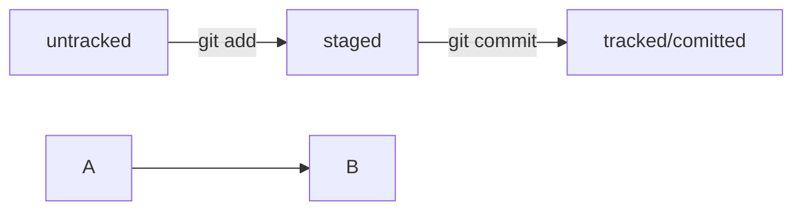

# assistant-project

echo "# assistant-project" >> README.md
git init
git add README.md
git commit -m "first commit"
git branch -M main
git remote add origin git@github.com:u-orda/assistant-project.git
git push -u origin main
Есть 4 состояния в GIT: tracable, untracable, staged, modified
 
Основной идентификатор коммита — это его хеш
Таблица соответствия хеш → информация о коммите хранится в папке .git.
Git хранит всю свою служебную информацию в этой папке, в том числе и таблицу, в которой можно найти коммит по хешу

Лог содержит описание коммита: хеш, автор, дата, сообщение.
Сокращенный лог помогает быстро найти нужный коммит среди множества.
Команда git log --oneline выводит сокращенный лог с хешами и комментариями.
Уникальная длина сокращенных хешей помогает идентифицировать коммит.

Файл HEAD (голова, головной) указывает на последний коммит в системе git. Файл HEAD находится в папке .git.
Для проверки содержимого файла HEAD можно использовать команду cat.
Внутри файла HEAD находится ссылка на служебный файл refs/heads/master, содержащий хеш последнего коммита.
При работе с Git указатель HEAD используется часто, его можно заменить на слово HEAD для передачи последнего коммита.

В Git файлы могут находиться в разных состояниях: untracked, staged, modified, tracked.
Untracked: новые файлы, не отслеживаемые Git.
Staged: файлы после git add, в списке для коммита.
Modified: файлы с изменениями относительно последней версии в staging.
Tracked: файлы, отслеживаемые Git, включая фиксированные и добавленные в staging.
Типичный жизненный цикл файла: создание, изменение, добавление в staging, коммит, изменение, добавление в staging, коммит.

Статусы файлов схема:

